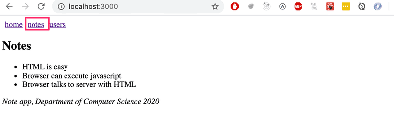
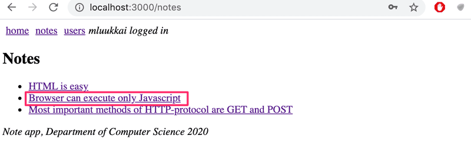
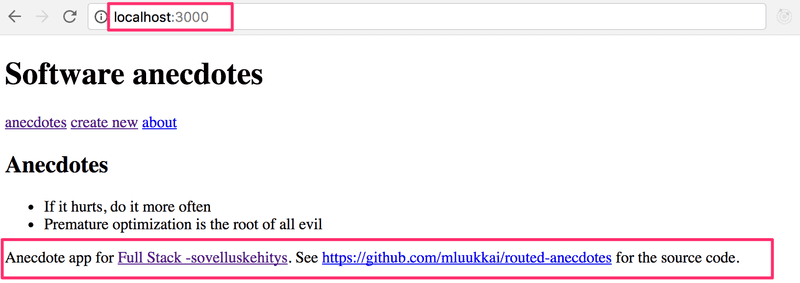
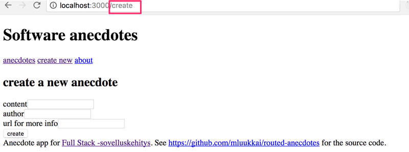
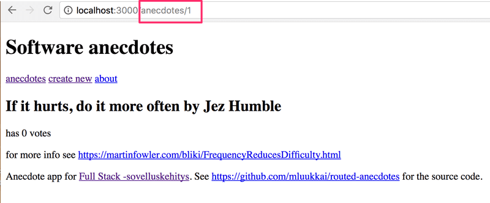
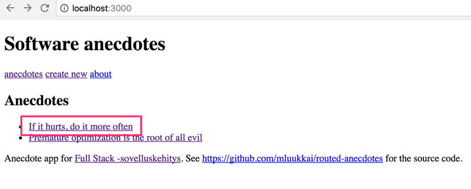
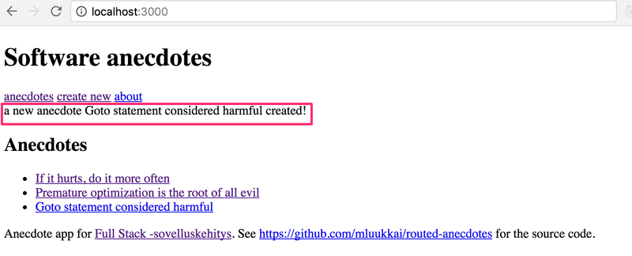
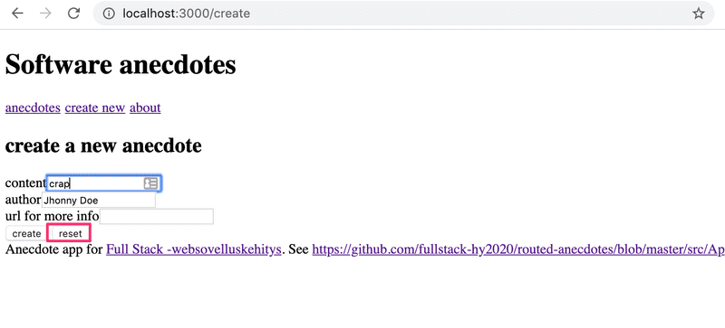

The seventh part of the course touches on several different themes. First, we'll get familiar with React Router. React Router helps us divide the application into different views that are shown based on the URL in the browser's address bar. After this, we'll look at a few more ways to add CSS styles to React applications. During the entire course, we've used Vite to build all of our applications. It is also possible to configure the whole toolchain yourself, and in this part we will see how this can be done with a tool called Webpack. We shall also have a look at hook functions and how to define a custom hook.

# Table of Contents

- [Part 7](#part-7)

# Part 7

## Part 7a - React Router

The exercises in this seventh part of the course differ a bit from the ones before. In this and the next chapter, as usual, there are [exercises related to the theory of the chapter](https://fullstackopen.com/en/part7/react_router#exercises-7-1-7-3).

In addition to the exercises in this and the next chapter, there are a series of exercises in which we'll be revising what we've learned during the whole course, by expanding the BlogList application, which we worked on during parts 4 and 5.

### Application navigation structure

Following part 6, we return to React without Redux.

It is very common for web applications to have a navigation bar, which enables switching the view of the application.

Our app could have a main page


and separate pages for showing information on notes and users:



In an [old school web app](https://fullstackopen.com/en/part0/fundamentals_of_web_apps#traditional-web-applications), changing the page shown by the application would be accomplished by the browser making an HTTP GET request to the server and rendering the HTML representing the view that was returned.

In single-page apps, we are, in reality, always on the same page. The Javascript code run by the browser creates an illusion of different "pages". If HTTP requests are made when switching views, they are only for fetching JSON-formatted data, which the new view might require for it to be shown.

The navigation bar and an application containing multiple views are very easy to implement using React.

Here is one way:

```js
import { useState }  from 'react'
import ReactDOM from 'react-dom/client'

const Home = () => (
  <div> <h2>TKTL notes app</h2> </div>
)

const Notes = () => (
  <div> <h2>Notes</h2> </div>
)

const Users = () => (
  <div> <h2>Users</h2> </div>
)

const App = () => {
  const [page, setPage] = useState('home')

  const toPage = (page) => (event) => {
    event.preventDefault()
    setPage(page)
  }

  const content = () => {
    if (page === 'home') {
      return <Home />
    } else if (page === 'notes') {
      return <Notes />
    } else if (page === 'users') {
      return <Users />
    }
  }

  const padding = {
    padding: 5
  }

  return (
    <div>
      <div>
        <a href="" onClick={toPage('home')} style={padding}>
          home
        </a>
        <a href="" onClick={toPage('notes')} style={padding}>
          notes
        </a>
        <a href="" onClick={toPage('users')} style={padding}>
          users
        </a>
      </div>

      {content()}
    </div>
  )
}

ReactDOM.createRoot(document.getElementById('root')).render(<App />)
```

Each view is implemented as its own component. We store the view component information in the application state called page. This information tells us which component, representing a view, should be shown below the menu bar.

However, the method is not very optimal. As we can see from the pictures, the address stays the same even though at times we are in different views. Each view should preferably have its own address, e.g. to make bookmarking possible. The _back_ button doesn't work as expected for our application either, meaning that _back_ doesn't move you to the previously displayed view of the application, but somewhere completely different. If the application were to grow even bigger and we wanted to, for example, add separate views for each user and note, then this self-made _routing_, which means the navigation management of the application, would get overly complicated.

### React Router

Luckily, React has the [React Router](https://reactrouter.com/) library which provides an excellent solution for managing navigation in a React application.

Let's change the above application to use React Router. First, we install React Router with the command:

```
npm install react-router-dom
```

The routing provided by React Router is enabled by changing the application as follows:

```js
import {
  BrowserRouter as Router,
  Routes, Route, Link
} from 'react-router-dom'

const App = () => {

  const padding = {
    padding: 5
  }

  return (
    <Router>
      <div>
        <Link style={padding} to="/">home</Link>
        <Link style={padding} to="/notes">notes</Link>
        <Link style={padding} to="/users">users</Link>
      </div>

      <Routes>
        <Route path="/notes" element={<Notes />} />
        <Route path="/users" element={<Users />} />
        <Route path="/" element={<Home />} />
      </Routes>

      <div>
        <i>Note app, Department of Computer Science 2024</i>
      </div>
    </Router>
  )
}
```

Routing, or the conditional rendering of components _based on the URL_ in the browser, is used by placing components as children of the _Router_ component, meaning inside _Router_ tags.

Notice that, even though the component is referred to by the name _Router_, we are talking about [BrowserRouter](https://reactrouter.com/en/main/router-components/browser-router), because here the import happens by renaming the imported object:

```js
import {
  BrowserRouter as Router,
  Routes, Route, Link
} from 'react-router-dom'
```

According to the [v5 docs](https://v5.reactrouter.com/web/api/BrowserRouter):

> _BrowserRouter_ is a _Router_ that uses the HTML5 history API (pushState, replaceState and the popState event) to keep your UI in sync with the URL.

Normally the browser loads a new page when the URL in the address bar changes. However, with the help of the [HTML5 history API](https://css-tricks.com/using-the-html5-history-api/), _BrowserRouter_ enables us to use the URL in the address bar of the browser for internal "routing" in a React application. So, even if the URL in the address bar changes, the content of the page is only manipulated using Javascript, and the browser will not load new content from the server. Using the back and forward actions, as well as making bookmarks, is still logical like on a traditional web page.

Inside the router, we define _links_ that modify the address bar with the help of the [Link](https://reactrouter.com/en/main/components/link) component. For example:

```js
<Link to="/notes">notes</Link>
```

creates a link in the application with the text _notes_, which when clicked changes the URL in the address bar to _/notes_.

Components rendered based on the URL of the browser are defined with the help of the component [Route](https://reactrouter.com/en/main/route/route). For example,

```js
<Route path="/notes" element={<Notes />} />
```

defines that, if the browser address is _/notes_, we render the _Notes_ component.

We wrap the components to be rendered based on the URL with a [Routes](https://reactrouter.com/en/main/components/routes) component

```js
<Routes>
  <Route path="/notes" element={<Notes />} />
  <Route path="/users" element={<Users />} />
  <Route path="/" element={<Home />} />
</Routes>
```

The Routes works by rendering the first component whose _path_ matches the URL in the browser's address bar.

### Parameterized route

Let's examine a slightly modified version from the previous example. The complete code for the updated example can be found [here](https://github.com/fullstack-hy2020/misc/blob/master/router-app-v1.js).

The application now contains five different views whose display is controlled by the router. In addition to the components from the previous example (_Home_, _Notes_ and _Users_), we have _Login_ representing the login view and _Note_ representing the view of a single note.

_Home_ and _Users_ are unchanged from the previous exercise. _Notes_ is a bit more complicated. It renders the list of notes passed to it as props in such a way that the name of each note is clickable.



The ability to click a name is implemented with the component _Link_, and clicking the name of a note whose id is 3 would trigger an event that changes the address of the browser into _notes/3_:

```js
const Notes = ({notes}) => (
  <div>
    <h2>Notes</h2>
    <ul>
      {notes.map(note =>
        <li key={note.id}>
          <Link to={`/notes/${note.id}`}>{note.content}</Link>
        </li>
      )}
    </ul>
  </div>
)
```

We define parameterized URLs in the routing of the _App_ component as follows:

```js
<Router>
  // ...

  <Routes>
    <Route path="/notes/:id" element={<Note notes={notes} />} />
    <Route path="/notes" element={<Notes notes={notes} />} />   
    <Route path="/users" element={user ? <Users /> : <Navigate replace to="/login" />} />
    <Route path="/login" element={<Login onLogin={login} />} />
    <Route path="/" element={<Home />} />      
  </Routes>
</Router>
```

We define the route rendering a specific note "express style" by marking the parameter with a colon - _:id_

```js
<Route path="/notes/:id" element={<Note notes={notes} />} />
```

When a browser navigates to the URL for a specific note, for example, _/notes/3_, we render the _Note_ component:

```js
import {
  // ...
  useParams
} from 'react-router-dom'

const Note = ({ notes }) => {
  const id = useParams().id
  const note = notes.find(n => n.id === Number(id)) 
  return (
    <div>
      <h2>{note.content}</h2>
      <div>{note.user}</div>
      <div><strong>{note.important ? 'important' : ''}</strong></div>
    </div>
  )
}
```

The `Note` component receives all of the notes as props _notes_, and it can access the URL parameter (the id of the note to be displayed) with the [useParams](https://reactrouter.com/en/main/hooks/use-params) function of the React Router.

### useNavigate

We have also implemented a simple login function in our application. If a user is logged in, information about a logged-in _user_ is saved to the user field of the state of the _App_ component.

The option to navigate to the _Login_ view is rendered conditionally in the menu.

```js
<Router>
  <div>
    <Link style={padding} to="/">home</Link>
    <Link style={padding} to="/notes">notes</Link>
    <Link style={padding} to="/users">users</Link>
    {user
      ? <em>{user} logged in</em>
      : <Link style={padding} to="/login">login</Link>
    }
  </div>

  // ...
</Router>
```

So if the user is already logged in, instead of displaying the link _Login_, we show its username:


The code of the component handling the login functionality is as follows:

```js
import {
  // ...
  useNavigate
} from 'react-router-dom'

const Login = (props) => {
  const navigate = useNavigate()

  const onSubmit = (event) => {
    event.preventDefault()
    props.onLogin('mluukkai')
    navigate('/')
  }

  return (
    <div>
      <h2>login</h2>
      <form onSubmit={onSubmit}>
        <div>
          username: <input />
        </div>
        <div>
          password: <input type='password' />
        </div>
        <button type="submit">login</button>
      </form>
    </div>
  )
}
```

What is interesting about this component is the use of the [useNavigate](https://reactrouter.com/en/main/hooks/use-navigate) function of the React Router. With this function, the browser's URL can be changed programmatically.

With user login, we call `navigate('/')` which causes the browser's URL to change to `/` and the application renders the corresponding component _Home_.

Both [useParams](https://reactrouter.com/en/main/hooks/use-params) and [useNavigate](https://reactrouter.com/en/main/hooks/use-navigate) are hook functions, just like useState and useEffect which we have used many times now. As you remember from part 1, there are some [rules](https://fullstackopen.com/en/part1/a_more_complex_state_debugging_react_apps/#rules-of-hooks) to using hook functions.

### Redirect 

There is one more interesting detail about the _Users_ route:

```js
<Route path="/users" element={user ? <Users /> : <Navigate replace to="/login" />} />
```

If a user isn't logged in, the _Users_ component is not rendered. Instead, the user is _redirected_ using the component [Navigate](https://reactrouter.com/en/main/components/navigate) to the login view:

```js
<Navigate replace to="/login" />
```

In reality, it would perhaps be better to not even show links in the navigation bar requiring login if the user is not logged into the application.

Here is the _App_ component in its entirety:

```js
const App = () => {
  const [notes, setNotes] = useState([
    // ...
  ])

  const [user, setUser] = useState(null) 

  const login = (user) => {
    setUser(user)
  }

  const padding = {
    padding: 5
  }

  return (
    <div>
      <Router>
        <div>
          <Link style={padding} to="/">home</Link>
          <Link style={padding} to="/notes">notes</Link>
          <Link style={padding} to="/users">users</Link>
          {user
            ? <em>{user} logged in</em>
            : <Link style={padding} to="/login">login</Link>
          }
        </div>

        <Routes>
          <Route path="/notes/:id" element={<Note notes={notes} />} />  
          <Route path="/notes" element={<Notes notes={notes} />} />   
          <Route path="/users" element={user ? <Users /> : <Navigate replace to="/login" />} />
          <Route path="/login" element={<Login onLogin={login} />} />
          <Route path="/" element={<Home />} />      
        </Routes>
      </Router>      
      <footer>
        <br />
        <em>Note app, Department of Computer Science 2024</em>
      </footer>
    </div>
  )
}
```

We define an element common for modern web apps called _footer_, which defines the part at the bottom of the screen, outside of the _Router_, so that it is shown regardless of the component shown in the routed part of the application.

### Parameterized route revisited

Our application has a flaw. The `Note` component receives all of the notes, event though it only displays the one whose id matches the URL parameter:

```js
const Note = ({ notes }) => { 
  const id = useParams().id
  const note = notes.find(n => n.id === Number(id))
  // ...
}
```

Would it be possible to modify the application so that the Note component receives only the note that it should display?

```js
const Note = ({ note }) => {
  return (
    <div>
      <h2>{note.content}</h2>
      <div>{note.user}</div>
      <div><strong>{note.important ? 'important' : ''}</strong></div>
    </div>
  )
}
```

One way to do this would be to use React Router's [useMatch](https://reactrouter.com/en/main/hooks/use-match) hook to figure out the id of the note to be displayed in the `App` component.

It is not possible to use the _useMatch_ hook in the component which defines the routed part of the application. Let's move the use of the `Router` components from `App`:

```js
ReactDOM.createRoot(document.getElementById('root')).render(
  <Router>
    <App />
  </Router>
)
```

The `App` component becomes:

```js
import {
  // ...
  useMatch
} from 'react-router-dom'

const App = () => {
  // ...

  const match = useMatch('/notes/:id')
  const note = match 
    ? notes.find(note => note.id === Number(match.params.id))
    : null

  return (
    <div>
      <div>
        <Link style={padding} to="/">home</Link>
        // ...
      </div>

      <Routes>
        <Route path="/notes/:id" element={<Note note={note} />} />
        <Route path="/notes" element={<Notes notes={notes} />} />   
        <Route path="/users" element={user ? <Users /> : <Navigate replace to="/login" />} />
        <Route path="/login" element={<Login onLogin={login} />} />
        <Route path="/" element={<Home />} />      
      </Routes>   

      <div>
        <em>Note app, Department of Computer Science 2024</em>
      </div>
    </div>
  )
}  
```

Every time the component is rendered, so practically every time the browser's URL changes, the following command is executed:

```js
const match = useMatch('/notes/:id')
```

If the URL matches `/notes/:id`, the match variable will contain an object from which we can access the parameterized part of the path, the id of the note to be displayed, and we can then fetch the correct note to display.

```js
const note = match 
  ? notes.find(note => note.id === Number(match.params.id))
  : null
```

The completed code can be found [here](https://github.com/fullstack-hy2020/misc/blob/master/router-app-v2.js).

<hr style="border: 2px solid rgb(125, 204, 240)">

### Exercises 7.1 - 7.3

Let's return to working with anecdotes. Use the redux-free anecdote app found in the repository https://github.com/fullstack-hy2020/routed-anecdotes as the starting point for the exercises.

If you clone the project into an existing git repository, remember to _delete the git configuration of the cloned application_:

```
cd routed-anecdotes   // go first to directory of the cloned repository
rm -rf .git
```

The application starts the usual way, but first, you need to install its dependencies:

```
npm install
npm run dev
```

#### 7.1: Routed Anecdotes, step 1

Add React Router to the application so that by clicking links in the _Menu_ component the view can be changed.

At the root of the application, meaning the path `/`, show the list of anecdotes:



The _Footer_ component should always be visible at the bottom. 

The creation of a new anecdote should happen e.g. in the path _create_:



#### 7.2: Routed Anecdotes, step 2

Implement a view for showing a single anecdote:



Navigating to the page showing the single anecdote is done by clicking the name of that anecdote:



#### 7.3: Routed Anecdotes, step 3

The default functionality of the creation form is quite confusing because nothing seems to be happening after creating a new anecdote using the form.

Improve the functionality such that after creating a new anecdote the application transitions automatically to showing the view for all anecdotes _and_ the user is shown a notification informing them of this successful creation for the next five seconds:



<hr style="border: 2px solid rgb(125, 204, 240)">

## Part 7b - Custom hooks

React offers 15 different [built-in hooks](https://react.dev/reference/react/hooks), of which the most popular ones are the [useState](https://react.dev/reference/react/useState) and [useEffect](https://react.dev/reference/react/useEffect) hooks that we have already been using extensively.

In [part 5](../part5/README.md#references-to-components-with-ref) we used the [useImperativeHandle](https://react.dev/reference/react/useImperativeHandle) hook which allows components to provide their functions to other components. In [part 6](../part6/README.md#part-6d---react-query-usereducer-and-the-context) we used [useReducer](https://react.dev/reference/react/useReducer) and [useContext](https://react.dev/reference/react/useContext) to implement a Redux like state management.

Within the last couple of years, many React libraries have begun to offer hook-based APIs. In [part 6](../part6/README.md#part-6a---flux-architecture-and-redux) we used the [useSelector](https://react-redux.js.org/api/hooks#useselector) and [useDispatch](https://react-redux.js.org/api/hooks#usedispatch) hooks from the react-redux library to share our redux-store and dispatch function to our components.

The [React Router's](https://reactrouter.com/en/main/start/tutorial) API we introduced in the [previous part](#part-7a---react-router) is also partially hook-based. Its hooks can be used to access URL parameters and the _navigation_ object, which allows for manipulating the browser URL programmatically.

As mentioned in [part 1](https://fullstackopen.com/en/part1/a_more_complex_state_debugging_react_apps#rules-of-hooks), hooks are not normal functions, and when using these we have to adhere to certain [rules or limitations](https://react.dev/warnings/invalid-hook-call-warning#breaking-rules-of-hooks). Let's recap the rules of using hooks, copied verbatim from the official React documentation:

__Don’t call Hooks inside loops, conditions, or nested functions__. Instead, always use Hooks at the top level of your React function.

__You can only call Hooks while React is rendering a function component__:

- Call them at the top level in the body of a function component. 

- Call them at the top level in the body of a custom Hook.

There's an existing [ESlint plugin](https://www.npmjs.com/package/eslint-plugin-react-hooks) that can be used to verify that the application uses hooks correctly:


### Custom hooks

React offers the option to create [custom](https://react.dev/learn/reusing-logic-with-custom-hooks) hooks. According to React, the primary purpose of custom hooks is to facilitate the reuse of the logic used in components.

> Building your own Hooks lets you extract component logic into reusable functions.

Custom hooks are regular JavaScript functions that can use any other hooks, as long as they adhere to the [rules of hooks](https://fullstackopen.com/en/part1/a_more_complex_state_debugging_react_apps#rules-of-hooks). Additionally, the name of custom hooks must start with the word `use`.

We implemented a counter application in [part 1](https://fullstackopen.com/en/part1/component_state_event_handlers#event-handling) that can have its value incremented, decremented, or reset. The code of the application is as follows:

```js
import { useState } from 'react'
const App = () => {
  const [counter, setCounter] = useState(0)

  return (
    <div>
      <div>{counter}</div>
      <button onClick={() => setCounter(counter + 1)}>
        plus
      </button>
      <button onClick={() => setCounter(counter - 1)}>
        minus
      </button>      
      <button onClick={() => setCounter(0)}>
        zero
      </button>
    </div>
  )
}
```

Let's extract the counter logic into a custom hook. The code for the hook is as follows:

```js
const useCounter = () => {
  const [value, setValue] = useState(0)

  const increase = () => {
    setValue(value + 1)
  }

  const decrease = () => {
    setValue(value - 1)
  }

  const zero = () => {
    setValue(0)
  }

  return {
    value, 
    increase,
    decrease,
    zero
  }
}
```

Our custom hook uses the `useState` hook internally to create its state. The hook returns an object, the properties of which include the value of the counter as well as functions for manipulating the value.

React components can use the hook as shown below:

```js
const App = () => {
  const counter = useCounter()

  return (
    <div>
      <div>{counter.value}</div>
      <button onClick={counter.increase}>
        plus
      </button>
      <button onClick={counter.decrease}>
        minus
      </button>      
      <button onClick={counter.zero}>
        zero
      </button>
    </div>
  )
}
```

By doing this we can extract the state of the `App` component and its manipulation entirely into the `useCounter` hook. Managing the counter state and logic is now the responsibility of the custom hook.

The same hook could be _reused_ in the application that was keeping track of the number of clicks made to the left and right buttons:

```js 
const App = () => {
  const left = useCounter()
  const right = useCounter()

  return (
    <div>
      {left.value}
      <button onClick={left.increase}>
        left
      </button>
      <button onClick={right.increase}>
        right
      </button>
      {right.value}
    </div>
  )
}
```

The application creates _two_ completely separate counters. The first one is assigned to the variable `left` and the other to the variable `right`.

Dealing with forms in React is somewhat tricky. The following application presents the user with a form that requires him to input their name, birthday, and height:

```js
const App = () => {
  const [name, setName] = useState('')
  const [born, setBorn] = useState('')
  const [height, setHeight] = useState('')

  return (
    <div>
      <form>
        name: 
        <input
          type='text'
          value={name}
          onChange={(event) => setName(event.target.value)} 
        /> 
        <br/> 
        birthdate:
        <input
          type='date'
          value={born}
          onChange={(event) => setBorn(event.target.value)}
        />
        <br /> 
        height:
        <input
          type='number'
          value={height}
          onChange={(event) => setHeight(event.target.value)}
        />
      </form>
      <div>
        {name} {born} {height} 
      </div>
    </div>
  )
}
```

Every field of the form has its own state. To keep the state of the form synchronized with the data provided by the user, we have to register an appropriate _onChange_ handler for each of the _input_ elements.

Let's define our own custom `useField` hook that simplifies the state management of the form:

```js
const useField = (type) => {
  const [value, setValue] = useState('')

  const onChange = (event) => {
    setValue(event.target.value)
  }

  return {
    type,
    value,
    onChange
  }
}
```

The hook function receives the type of the input field as a parameter. It returns all of the attributes required by the _input_: its type, value and the onChange handler.

The hook can be used in the following way:

```js
const App = () => {
  const name = useField('text')
  // ...

  return (
    <div>
      <form>
        <input
          type={name.type}
          value={name.value}
          onChange={name.onChange} 
        /> 
        // ...
      </form>
    </div>
  )
}
```

### Spread attributes

We could simplify things a bit further. Since the `name` object has exactly all of the attributes that the _input_ element expects to receive as props, we can pass the props to the element using the [spread syntax](https://developer.mozilla.org/en-US/docs/Web/JavaScript/Reference/Operators/Spread_syntax) in the following way:

```js
<input {...name} />
```

As the [example](https://react.dev/learn/updating-objects-in-state#copying-objects-with-the-spread-syntax) in the React documentation states, the following two ways of passing props to a component achieve the exact same result:

```js
<Greeting firstName='Arto' lastName='Hellas' />

const person = {
  firstName: 'Arto',
  lastName: 'Hellas'
}

<Greeting {...person} />
```

The application gets simplified into the following format:

```js
const App = () => {
  const name = useField('text')
  const born = useField('date')
  const height = useField('number')

  return (
    <div>
      <form>
        name: 
        <input  {...name} /> 
        <br/> 
        birthdate:
        <input {...born} />
        <br /> 
        height:
        <input {...height} />
      </form>
      <div>
        {name.value} {born.value} {height.value}
      </div>
    </div>
  )
}
```

Dealing with forms is greatly simplified when the unpleasant nitty-gritty details related to synchronizing the state of the form are encapsulated inside our custom hook.

Custom hooks are not only a tool for reusing code; they also provide a better way for dividing it into smaller modular parts.

### More about hooks

The internet is starting to fill up with more and more helpful material related to hooks. The following sources are worth checking out:

- [Awesome React Hooks Resources](https://github.com/rehooks/awesome-react-hooks)

- [Easy to understand React Hook recipes by Gabe Ragland](https://usehooks.com/)

- [Why Do React Hooks Rely on Call Order?](https://overreacted.io/why-do-hooks-rely-on-call-order/)

<hr style="border: 2px solid rgb(125, 204, 240)">

### Exercises 7.4 - 7.8

We'll continue with the app from the [exercises](#exercises-71---73) of the react [router chapter](#part-7a---react-router).

#### 7.4: Anecdotes and Hooks, step 1

Simplify the anecdote creation form of your application with the `useField` custom hook we defined earlier.

One natural place to save the custom hooks of your application is in the _/src/hooks/index.js_ file.

If you use the [named export](https://developer.mozilla.org/en-US/docs/Web/JavaScript/Reference/Statements/export#Description) instead of the default export:

```js
import { useState } from 'react'

export const useField = (type) => {
  const [value, setValue] = useState('')

  const onChange = (event) => {
    setValue(event.target.value)
  }

  return {
    type,
    value,
    onChange
  }
}

// modules can have several named exports
export const useAnotherHook = () => {
  // ...
}
```

Then [importing](https://developer.mozilla.org/en-US/docs/Web/JavaScript/Reference/Statements/import) happens in the following way:

```js
import  { useField } from './hooks'

const App = () => {
  // ...
  const username = useField('text')
  // ...
}
```   

#### 7.5: Anecdotes and Hooks, step 2

Add a button to the form that you can use to clear all the input fields:



Expand the functionality of the _useField_ hook so that it offers a new _reset_ operation for clearing the field.

Depending on your solution, you may see the following warning in your console:


We will return to this warning in the next exercise.

#### 7.6: Anecdotes and Hooks, step 3

If your solution did not cause a warning to appear in the console, you have already finished this exercise.

If you see the `Invalid value for prop "reset" on <input> tag` warning in the console, make the necessary changes to get rid of it.

The reason for this warning is that after making the changes to your application, the following expression:

```js
<input {...content}/>
```

Essentially, is the same as this:

```js
<input
  value={content.value} 
  type={content.type}
  onChange={content.onChange}
  reset={content.reset} // <--
/>
```

The _input_ element should not be given a _reset_ attribute.

One simple fix would be to not use the spread syntax and write all of the forms like this:

```js
<input
  value={username.value} 
  type={username.type}
  onChange={username.onChange}
/>
```

If we were to do this, we would lose much of the benefit provided by the _useField_ hook. Instead, come up with a solution that fixes the issue, but is still easy to use with the spread syntax.

